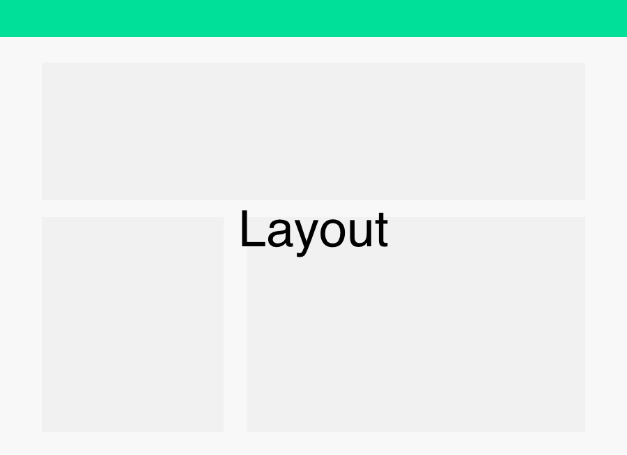
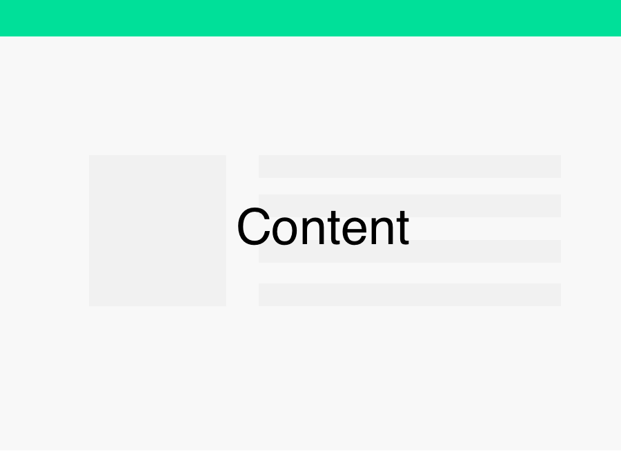

Frontend Architecture
======================

## Table of Contents
* [Goals](#goals)
* [Non-Goals](#non-goals)

## Goals
The goal of the new frontend architecture:

1. Make developers more **productive**.
1. **Opinionate** on what developers should write.
1. Achieve high level **UI/UX**, as in the mobile.
1. Give developers **full control** of markup and styling.
1. Platform **agnostic**.

## Non-Goals
The non-goals of the new architecture:

1. Not giving developer full control over markup and styling.
1. Excessively restrict developers.
1. Targeted to only one platform.

## Overview
The Frontend Architecture supports client-side and server side rendering, some people might also know it as *isomorphic rendering*. We primarily use a *MV architecture* with the *Controller* sitting on the view(for updating view state on clicks etc). And a *Router* which is also a *Controller* in most architecture definitions is being processed through a client router and a server router depending on what is being requested. 

*Note, in recent years it’s quite common to move some of the controller’s tasks or roles into the view. Otherwise, the view have to pass events to the controller and let the controller handle those event. Nowadays, some tasks, such as handling click events are directly managed in the views.* 

## Rendering Layers 
The rendering pipeline goes through certain layers. Each layers has it own purpose in the rendering pipeline and they currently consists of Document-, Layout- and Content Layer. In each layer, there can only exists their respective views Document-, Layout- and Content Views. Dividing it into rendering layers helps the Router to keep track of and manipulate views during page transitions.

</img>

### Document Layer
The Document Layer consists of the abstract part of the page. It is here we put header data such as meta, script and style tags. The Document Layer has only one single placeholder for Layout Views.

</img>

### Layout Layer
The Layout Layer, as the name suggests, is the layout of a page. The layout has placeholders where Content Views can be placed. Note, the Layout Layer also includes an overlay as a placeholder to dialog windows and modal windows.

</img>

### Content Layer
The Content Layer consists of HTML markup for the content. Or other Component Views.

</img>

### ComponentLayer
This layer only includes Component Views. You can read more about Component Views in the next chapter.

## View Classes
*(A View Class is equivalent to a React Component Class. We use the terminology View instead of React’s Component, because we have Component Layer that includes Component Views. If we used React’s Component terminology we would call it Component Component Class, instead of Component View Class. Whether, we are using React is also in discussion.)*

### Document View Class
A Base View for housing all the markup of the document. The Document View needs to include markup and styling for transitioning between layouts.

### Layout View Class
Extends *Content Base View Class* for housing all the markup of the layout. Must include markup and styles for transitioning between contents. It also includes handlers for processing page transitions.

#### pushContent(content: ContentView): void; [OPTIONAL]
Push content. Only available for stacked page layouts.

<div>
    </img>
</div>
<i>The new content is stacked on top of the current content.</i>

#### pushLoadingContent(content: ContentView): void; [OPTIONAL]
Push content with a loading bar, until new content is loaded.

<div>
    </img>
</div>

#### popContent(): void; [OPTIONAL]
Pop content. The last content in the stack will be popped.

<div>
    </img>
</div>

#### popAllContent(): void; [OPTIONAL]
Pop all content, except the first.

<div>
    </img>
</div>
<i>Pages popping or animating down.</i>

#### replaceWithLoadingContent(content: ContentView): void; [OPTIONAL]
Replace content with a loading bar, until new content is loaded.

<div>
    </img>
</div>
<i>The current content is replaced with a loading bar that load the next content.</i>

#### replaceWithContent(content: ContentView): void; [OPTIONAL]
Replace content.

### Content View Class
*Content View Class* extends the *Content Base View Class* and includes methods for setting page title, description and other headers of the page. This class also returns position and size for visual baseline testing.

#### static setPageInfo(info: PageInfo, l: GetLocalization): void; [OPTIONAL]
Set the page’s info. This includes title, description, keywords and image. A localization getter is inserted so you can also localize your strings.

<div>
    </img>
</div>
<i>Title, description and image of a page in Gitlab*</i>

#### __getSizeAndPosition(): SizeAndPosition;
An internal method to get the size and position of a Content View Class. The position and size will be later used for visual baseline testing.

### Content Base View Class
*Content Base View Class* has methods for alerting, prompting user and it also have a reference to a data class for handling data.

#### alert(title: string, description: string | BaseView): void;
Alert user. An alert requires the user to dismiss the alert.

#### prompt(text: string): void;
Prompt the user. A prompt is automatically dismissed after 5 seconds.

#### confirm(title: string, description: string | BaseView): Promise<boolean>;
Let the user confirm something. This will present the user of 

#### warn(text: string): void;
Warn the user. The view has a warning sign or/and is yellow.

#### error(text: string): void;
Present an error to the user. The view has a error sign or/and is red.

### Component View Class
*Component View Class* extends *Base View Class*. Use this class to write generic components that can be used by all your *Content Views*. Example of components can be buttons, modal and dialogue windows, labels, fields, etc. The primary difference between *Component View Class* and *Content Base View Class* is that the former is more isolated and cannot reference data by default and cannot reference default components, which makes it ideal for writing components.
### Base View Class
The Base View Class extends [React Component]. It will provide the basic view engine for rendering, manipulating view, handling different mouse events etc.

*My current opinion is to use React. It offers JSX, which is quite a productive syntax, and higher order components, though it might have some performance issues on the server, which we need to investigate.*

## Default Components
There are two types of default components. One for being used inside other components and one being called from inside Content View Class.

### Callable Component
The *Content View Class* has the method **alert(text: string)**. The alert view is a default *Callable Component*. *Callable Components* can only be referenced through method calls inside a *Content View Class*.

### Insertable Component
Insertable component is components that you can insert in the markup of a view. For instance, a link component:

```jsx
<Link href='/path'/>
```

## Page Rendering

### Definition
A page, is defined as a render for a certain URL defined in the Page Manifestation.

### Server-Side Rendering
The page rendering begins with a Router reading a Page Manifestation. The router inspect which route is being requested and checks against the Page Manifestation, which layout and which models and views is being requested for a particular route. It fetches data for each Content View before assembling all the markup on the server side.

<div>
  </img>
</div>

### Client-Side Rendering
On the client side, the Client Router notifies the current Layout that there is a page transition occurring and calls onBeforePageTransition.

- If the new page has the same Layout:
    - If the layout has a stacked region for serving *Stacked Pages*: The *Client Router* calls the current layout method **pushContent** or **pushLoadingContent**, depending on if it is a static content or not.
    - If the layout is only serving *Replacing Pages*: The *Client Router* calls the current layout method **replaceWithContent** or **replacetWithLoadingContent**, depending on if it is a static content or not.
- If the new page has a different layout it makes a layout transition and inserts the new content.

### Page Manifestation
The page manifestation just manifests on which route has which layout and model and views. 

Here is an example:

```ts
'/reset-password': page => {
    page.platform(OfflineWeb)
        .layout(WebLandingPageLayout, {
            Header: {
                view: LandingPageTopBarView,
            },
            Body: {
                view: ResetPasswordFormView,
            },
        })
        .end();
},
```

## Styling

### Selector Naming Convention
All selectors will be defined with using ComponentName[Selector] convention. 

```sass
.FeedTitle { 
    position: absolute;
    width: 100%;
}

.FeedDescription {
    position: absolute;
    width: 100%;
}
```

### State Selectors
State Selectors can be used for differentiate styles during different view states.

```sass
.FeedTitle { 
    position: absolute;
    width: 100%;

    &.Hidden {
         opacity: 0;
    }
}
```

## Data Classes
The Data Classes helps with data handling. They provide capabilities like fetching and registering on data events, serialization, deserialization, URL/JSON mapping, relation mapping. subscription of pushed data etc.
### Model Class
Model represent data of single objects.

The following example is an example of a Comment Model:

```ts
@Model.attributes({
    relations: {
        owner: User, // This lines adds User reference to the Comment model
        tags: Tags,
    },
})
export class Comment extends Model<CommentProps> {}
let user = User.create({ id: 1, name: 'Anders'});
let comment = Comment.create({ text: ‘hello world’. owner: user});
comment.save();

// HTTP POST:
// {
//    text: ‘hello world’,
//    user:  1,
// }
```

When a saved object wants to update. A normal call to the save method will do the job:

```ts
comment.set(‘text’, ‘hello siri!’);
comment.save();

// HTTP PUT:
// {
//     text: ‘hello siri!’,
//     user:  1,
// }
```

### Collection Class
Collection represents data of multiple objects.

```ts
@Collection.attributes({
    model: Comment, // This registers Comment as the model for the collection
})
export class Comments extends Collection<Comment, any> {}
```

The collection can also subscribe on new(pushed) comments and load(pull) more comments.

```ts
let comments = Comments.create();
comments.subscribe();
comments.load();
comments.on('add', doSomething);
```

### Adapters
For mapping from object to JSON we will need to develop adapters.

## Internationalization
L10ns for workflow and formatting complex translation strings.

The localization getter l() will be injected into every Content View Class.

## Folder Structure
This is the suggested folder structure of the project:

```
/Components
/Configurations
/Content
/Core
/Document
/Layouts
/Library
/Localizations
/Public
    /Fonts
    /Icons
    /Images
    /Scripts
        /Vendor
/Styles
/Tasks
/Tests
    /Baselines
        /Cases
        /Current
        /Reference
    /UnitTests
```

### Components
This folder contains all Component Classes.

### Configurations
This folder contains all configurations for both the server and the client and maybe other platforms. Each platform configuration should have its own file.

### Content
The Content Classes will be stored in this folder. If the View Class and Data Class are highly related and independent of other View Classes and DataClasses. They can be grouped together in a subfolder.

### Core
Core represents that specific code for driving this architecture.

### Documents
Contains Document Classes.

### Layouts
Contains Layout Classes.

### Library
Libraries such as Model, Collection HTTPClient etc.

### Localizations
Contains the storage of localization files.

### Public
Public contains all public static files. This folder can only contain static files due to security reasons.

### Styles
An index SASS files will import all Content SASS files. This folder will also contain generic style classes such as animations, backgrounds, buttons, colors, forms, layouts, text, miscellaneous, normalize.

### Tasks
All defined custom tasks will be in this folder.

### Tests
All files for defining test cases and generated test outputs will be put under this folder.
